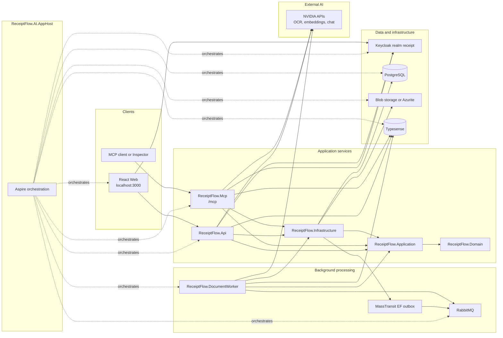
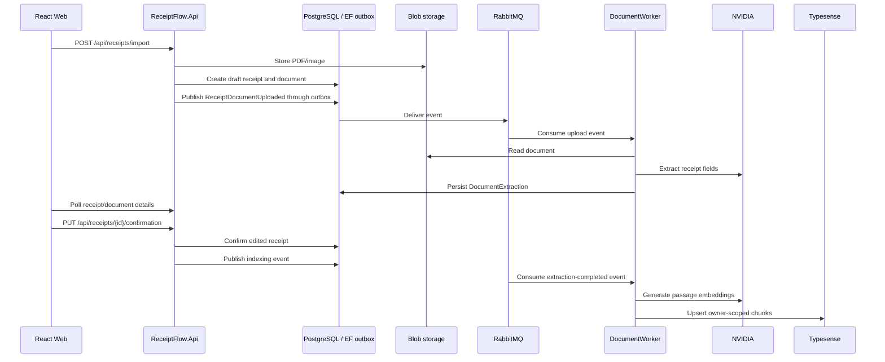
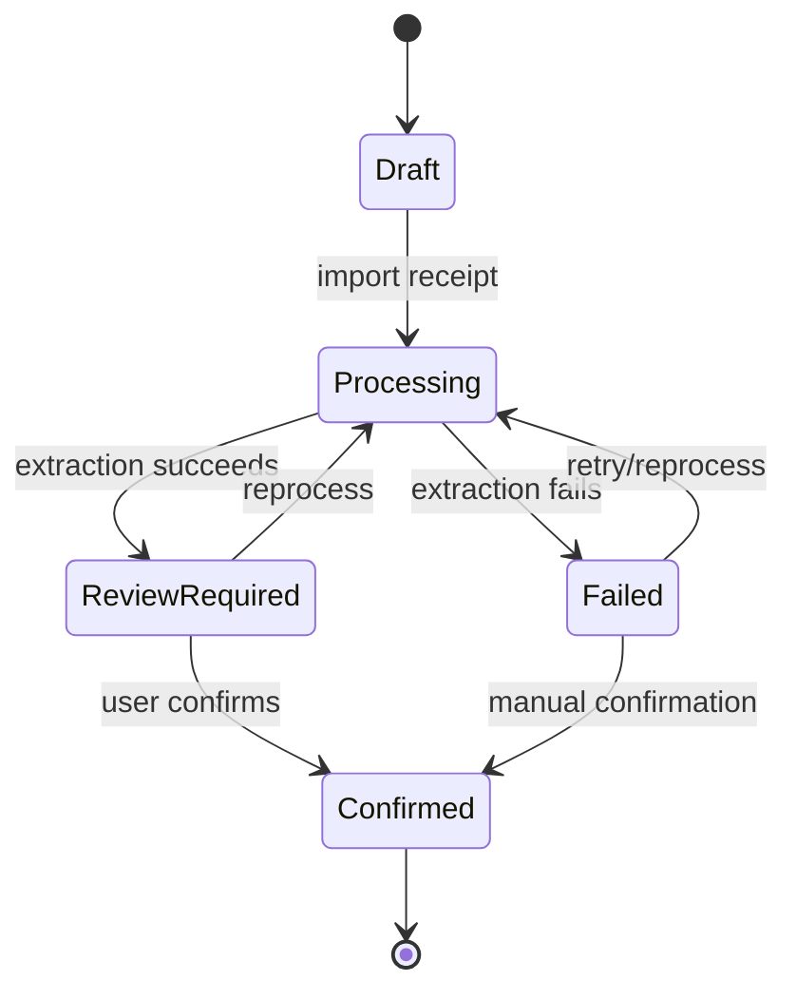
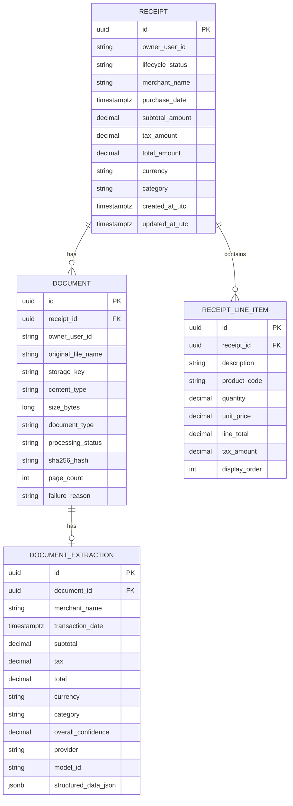

# ReceiptFlow.AI

ReceiptFlow.AI is a portfolio/demo receipt intelligence application:

`Upload receipt -> AI extraction -> Review and confirm -> Hybrid search -> Grounded assistant answer with citations`

It demonstrates a .NET Clean Architecture backend, a React 19 frontend, authenticated multi-user data isolation, asynchronous document processing, PostgreSQL persistence, RabbitMQ/MassTransit messaging, Typesense hybrid retrieval, NVIDIA-backed extraction/embeddings/answer generation, MCP tools, and .NET Aspire local orchestration.

## Screenshots

No safe repository screenshots are currently checked in.

Screenshot checklist for a portfolio README:

- Dashboard with totals, processing count and recent receipts.
- Upload/review page showing a PDF or image receipt moving through extraction.
- Receipt details page with editable extracted fields and line items.
- Hybrid search results with owner-scoped receipt evidence.
- Assistant answer with at least one source citation card.

Store curated screenshots under `docs/images/` with lowercase filenames before referencing them here. Do not include tokens, passwords, connection strings, admin screens or private receipt data.

## Key Capabilities

Frontend:

- React 19, Vite, TypeScript, Tailwind CSS v4 and shadcn-style primitives.
- Responsive application shell, dark mode, route loading, error and empty states.
- Keycloak Authorization Code flow with PKCE S256.
- Authenticated API client with token refresh and 401 handling.
- Dashboard, receipt list/details, upload-first document import, extraction review, confirmation, hybrid search and grounded assistant pages.

Backend:

- .NET 10 Clean Architecture with Domain, Application, Infrastructure and host projects.
- JWT bearer validation against Keycloak with issuer, audience, signature and lifetime checks.
- Owner isolation from the Keycloak `sub` claim. Public requests do not accept owner IDs.
- PostgreSQL with EF Core migrations, MassTransit EF outbox tables and owner-filtered repositories.
- Document storage abstraction with local storage and Azure Blob/Azurite support.
- RabbitMQ/MassTransit document events and a worker for extraction and indexing.
- NVIDIA integrations behind Application abstractions for extraction, embeddings and answer generation.
- Typesense hybrid keyword/vector search with owner filters.
- Stateless Streamable HTTP MCP server exposing read-only receipt tools.
- Aspire AppHost for PostgreSQL, Azurite, RabbitMQ, Typesense, Keycloak, API, worker, MCP and Vite.

## Architecture



Project dependency summary:

| Project | Role |
| --- | --- |
| `ReceiptFlow.Domain` | Domain entities, enums and invariants; no project references. |
| `ReceiptFlow.Contracts` | Message contracts shared by API, worker and infrastructure. |
| `ReceiptFlow.Application` | Use cases and provider-neutral abstractions; references Domain and Contracts. |
| `ReceiptFlow.Infrastructure` | EF Core, storage, MassTransit, NVIDIA and Typesense implementations. |
| `ReceiptFlow.Api` | Authenticated HTTP API host. |
| `ReceiptFlow.DocumentWorker` | MassTransit consumers for extraction and indexing. |
| `ReceiptFlow.Mcp` | Authenticated stateless Streamable HTTP MCP server. |
| `ReceiptFlow.Web` | React/Vite application. |
| `ReceiptFlow.AI.ServiceDefaults` | Shared Aspire health, resilience, discovery and OpenTelemetry defaults. |
| `ReceiptFlow.AI.AppHost` | Local orchestration for app services and containers. |
| `ReceiptFlow.Api.Tests` | Backend integration/unit tests. Frontend tests live under `ReceiptFlow.Web/src`. |

## Core Workflow



More diagrams are in [Architecture](docs/architecture.md).

## Receipt Lifecycle

The source enum is `ReceiptLifecycleStatus`:



Draft receipts do not store fabricated merchant, date or amount metadata. AI extraction is persisted as a suggestion on `DocumentExtraction`; spending totals and search indexing use confirmed receipts.

## Data Model Preview



MassTransit `InboxState`, `OutboxMessage` and `OutboxState` are infrastructure tables and are omitted from the core business ER diagram.

## API Overview

All product endpoints require authentication unless noted.

| Method | Route | Purpose |
| --- | --- | --- |
| `GET` | `/api/auth/me` | Current authenticated profile from token claims. |
| `GET` | `/api/dashboard` | Owner-scoped totals, processing count and recent receipts. |
| `GET` | `/api/receipts` | Paginated owner-scoped receipt list. |
| `POST` | `/api/receipts` | Create a confirmed manual receipt. |
| `POST` | `/api/receipts/import` | Upload-first PDF/image import that creates a draft receipt. |
| `GET` | `/api/receipts/{id}` | Receipt details. |
| `PUT` | `/api/receipts/{receiptId}/confirmation` | Confirm or edit extracted receipt details. |
| `POST` | `/api/receipts/{receiptId}/documents` | Upload a document to an existing receipt. |
| `GET` | `/api/receipts/{receiptId}/documents` | List receipt documents. |
| `GET` | `/api/receipts/{receiptId}/documents/{documentId}` | Document status and extraction details. |
| `POST` | `/api/receipts/{receiptId}/documents/{documentId}/reindex` | Requeue a completed extracted document for indexing. |
| `POST` | `/api/search/receipts` | Hybrid keyword/vector receipt search. |
| `POST` | `/api/assistant/receipts/ask` | Grounded receipt answer with trusted citations. |
| `GET` | `/WeatherForecast` | Template/sample endpoint; not part of the product API. |

## MCP

`ReceiptFlow.Mcp` exposes a stateless Streamable HTTP endpoint at `/mcp`. It requires a bearer token with audience `receiptflow-mcp` and a `sub` claim. Tools are read-only and owner isolation is derived from the token, never from a tool argument.

| Tool | Parameters | Purpose |
| --- | --- | --- |
| `search_receipts` | `query`, `page`, `pageSize` | Tenant-isolated hybrid receipt search. |
| `ask_receipts` | `question` | Grounded assistant answer with trusted citations. |

See [MCP details](docs/local-development.md#mcp-inspector).

## Technology Stack

| Area | Version/source |
| --- | --- |
| .NET / ASP.NET Core | `net10.0`, ASP.NET package refs `10.0.10` |
| EF Core / Npgsql | EF Core `10.0.10`, Npgsql EF provider `10.0.3` |
| Aspire | `13.4.6`; Keycloak hosting package `13.4.6-preview.1.26319.6` |
| MassTransit | `9.1.2` with RabbitMQ and EF Core outbox |
| PostgreSQL | Aspire PostgreSQL resource, local port `5432` |
| RabbitMQ | Aspire RabbitMQ resource |
| Keycloak | Aspire Keycloak resource; server image version is not pinned in source |
| Typesense | Container image `typesense/typesense:28.0` |
| React | `19.2.7` |
| TypeScript | `6.0.3` |
| Vite | `8.1.5` |
| Tailwind CSS | `4.3.3` with `@tailwindcss/vite` |
| TanStack Query | `5.101.2` |
| Keycloak JS | `26.2.4` |
| Vitest / Testing Library | Vitest `4.1.10`, Testing Library React `16.3.2` |
| Azure Blob / Azurite | Azure.Storage.Blobs `12.29.1`, Aspire Azure Storage emulator, Testcontainers Azurite `4.13.0` |
| NVIDIA | OpenAI-compatible HTTPS integrations configured by appsettings/secrets |

## Quick Start

Prerequisites:

- .NET SDK 10.
- Node.js `22.20.0` or compatible with `ReceiptFlow.Web/.node-version`.
- npm.
- Docker Desktop.
- EF Core CLI: `dotnet tool install --global dotnet-ef` if not already installed.
- Trusted development HTTPS certificate: `dotnet dev-certs https --trust`.
- NVIDIA API access for live extraction, embeddings and assistant answers.

PowerShell:

```powershell
dotnet restore ReceiptFlow.AI.slnx
npm install --prefix ReceiptFlow.Web

dotnet user-secrets set "Parameters:nvidia-api-key" "<nvidia-api-key>" --project ReceiptFlow.AI.AppHost
dotnet user-secrets set "Parameters:typesense-api-key" "<typesense-api-key>" --project ReceiptFlow.AI.AppHost

dotnet dev-certs https --trust
dotnet run --project ReceiptFlow.AI.AppHost
```

Then:

1. Open the Aspire dashboard URL printed by AppHost.
2. Confirm Keycloak has the `receipt` realm and the `receiptflow-web` client.
3. Apply EF migrations if the database is empty or pending:
   `dotnet ef database update --project ReceiptFlow.Infrastructure --startup-project ReceiptFlow.Api`
4. Open the web frontend at `http://localhost:3000`.
5. Sign in, upload a PDF/image receipt, wait for extraction, review/edit, confirm, search and ask the assistant.

The frontend public origin is intentionally fixed at `http://localhost:3000`. Aspire may use an internal dynamic Vite target URL behind the proxy; use the public origin for browser and Keycloak redirect settings.

## Documentation

- [Architecture and workflows](docs/architecture.md)
- [Local development, configuration and testing](docs/local-development.md)
- [Keycloak setup](docs/keycloak.md)
- [Azure demo deployment guidance](docs/deployment.md)
- [Troubleshooting](docs/troubleshooting.md)

## Test Commands

```powershell
dotnet build ReceiptFlow.AI.slnx --no-restore
dotnet test ReceiptFlow.AI.slnx --no-build
dotnet list ReceiptFlow.AI.slnx package --vulnerable

npm run lint --prefix ReceiptFlow.Web
npm run test --prefix ReceiptFlow.Web
npm run build --prefix ReceiptFlow.Web
npm audit --prefix ReceiptFlow.Web

dotnet ef migrations has-pending-model-changes --project ReceiptFlow.Infrastructure --startup-project ReceiptFlow.Api
git diff --check
```

The .NET tests cover domain/application behavior, authenticated API endpoints, storage, messaging, extraction, search, assistant and MCP handler behavior. Frontend tests cover the application shell, navigation, auth provider, API client and receipt workflows.

## Security Notes

- Authorization Code + PKCE is used for public clients.
- API and MCP hosts validate token issuer, audience, signature and lifetime.
- `owner_user_id` is derived from the Keycloak `sub` claim.
- Uploaded files are limited to 10 MiB and validated by extension, MIME type and file signature for PDF, PNG and JPEG.
- Storage keys are generated server-side and validated before reads.
- PostgreSQL queries and Typesense searches are tenant-filtered.
- Provider output is never trusted as citation metadata; citations are validated against application-assigned evidence.
- Secrets belong in user secrets or environment variables, never tracked files.
- Deployment needs HTTPS origins and exact redirect URIs.

## Demo Walkthrough

1. Sign in through Keycloak.
2. Upload a sample PDF or image receipt.
3. Show asynchronous processing and extraction status.
4. Review/edit merchant, date, totals and line items.
5. Confirm the receipt.
6. View dashboard totals and recent receipts.
7. Search for a merchant or purchased item.
8. Ask a grounded assistant question and show the citation source.
9. Ask an unanswerable question and show the grounded refusal.
10. Optionally connect MCP Inspector and call `search_receipts` or `ask_receipts`.

## Known Limitations and Roadmap

- Search results are currently chunk-level; grouping multiple chunks into one receipt-level result is a future UX improvement.
- MCP Inspector live verification depends on a separately registered MCP client and a valid token.
- Azure deployment is documented as demonstration guidance; infrastructure automation is not yet committed.
- NVIDIA is the implemented AI provider. Application abstractions allow alternatives later.
- No license file is present. The repository owner still needs to choose a license before reuse terms are clear.
