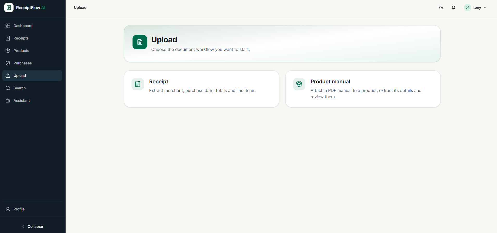
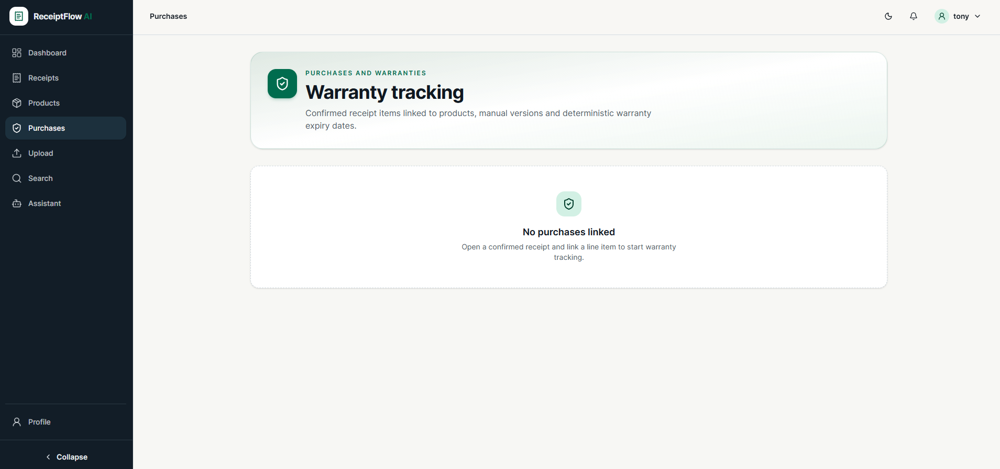
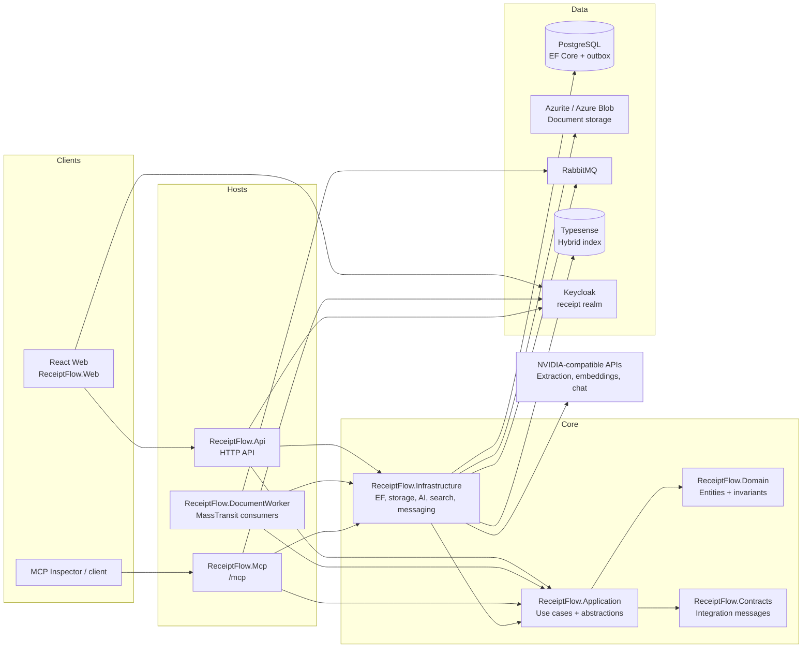
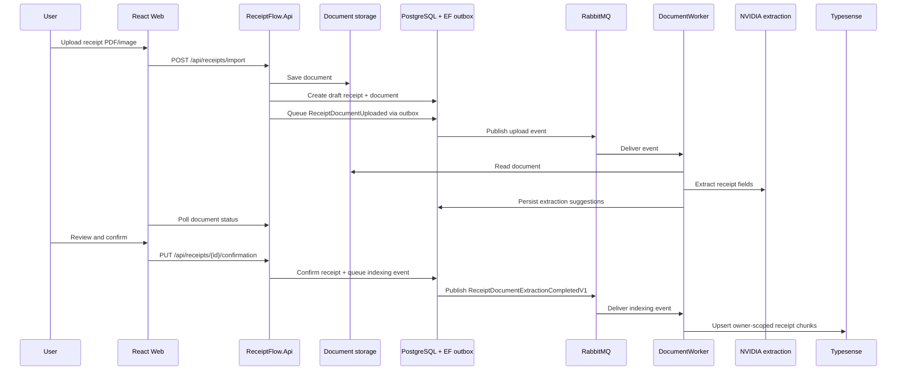
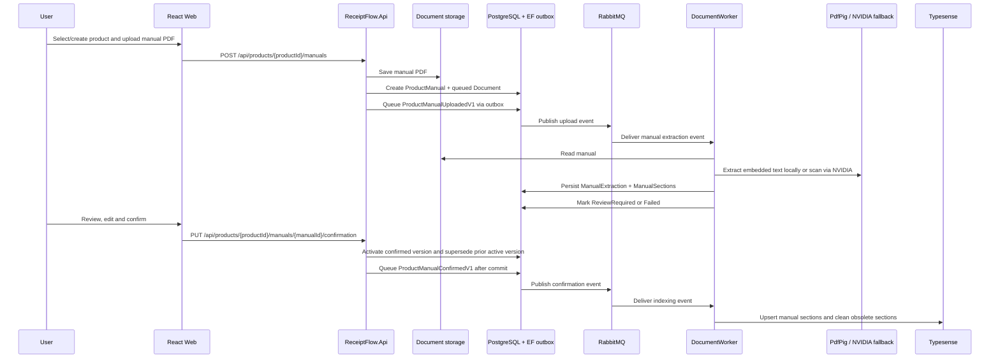
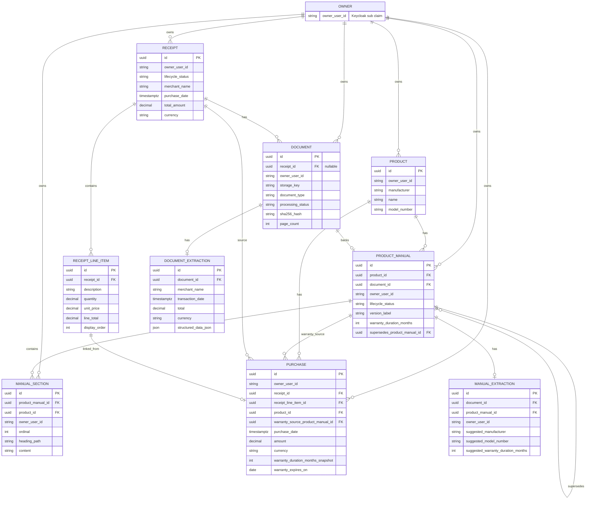

# ReceiptFlow.AI


ReceiptFlow.AI is a portfolio/demo receipt and product-manual intelligence platform. It combines authenticated document upload, asynchronous AI extraction, human review, hybrid search, grounded RAG answers with citations, read-only MCP tools, product-manual versioning, purchase linking and deterministic warranty tracking.

The project demonstrates a realistic full-stack architecture: .NET Clean Architecture, React 19, Keycloak owner isolation, EF Core/PostgreSQL persistence, MassTransit/RabbitMQ background workflows, Typesense hybrid retrieval, NVIDIA-backed extraction/embedding/chat implementations and .NET Aspire local orchestration.

> Project status: ReceiptFlow.AI is a polished portfolio/demo application. It demonstrates production-shaped architecture, but it is not presented as a hosted production service or turnkey SaaS product.

## Table of contents

- [Key capabilities](#key-capabilities)
- [Screenshots](#screenshots)
- [Architecture](#architecture)
- [Processing flows](#processing-flows)
- [Data model](#data-model)
- [Technology stack](#technology-stack)
- [Setup](#setup)
- [Configuration](#configuration)
- [Testing status](#testing-status)
- [Demo walkthrough](#demo-walkthrough)
- [Deployment](#deployment)
- [Documentation](#documentation)
- [Known documentation gaps](#known-documentation-gaps)

## Key capabilities

- Keycloak authentication with bearer-token validation and owner isolation from the `sub` claim.
- Receipt PDF/image upload, server-side file validation, asynchronous extraction, review and confirmation.
- Product creation plus product-manual PDF upload, extraction, review, versioning, activation and supersession.
- Typesense hybrid keyword/vector search over confirmed receipts and confirmed manual sections.
- Grounded assistant that cites only retrieved evidence and refuses when evidence cannot answer.
- Authenticated MCP tools for receipt/manual search and grounded questions.
- Receipt-line-item to product purchase linking with deterministic warranty expiry from receipt purchase date plus snapshotted manual warranty duration.
- React 19/Vite/Tailwind frontend with upload, review, search, assistant, products, manuals, purchases and warranty views.
- Aspire AppHost for local PostgreSQL, Azurite, RabbitMQ, Typesense, Keycloak, API, worker, MCP and Vite orchestration.

## Screenshots

Real application screenshots are used where suitable assets already exist. Partial and missing captures are explicitly labelled; no application screenshots are fabricated.

| Portfolio area                       | Screenshot status                                                                                                                | Preview or placeholder                                                                                                             |
| ------------------------------------ | -------------------------------------------------------------------------------------------------------------------------------- | ---------------------------------------------------------------------------------------------------------------------------------- |
| Aspire dashboard                     | **Captured**                                                                                                                     |                                    |
| Receipt dashboard                    | **Captured**                                                                                                                     |                               |
| Receipt upload and extraction review | **Partial capture** — the upload entry point is shown; capture the populated extraction-review form during the final demo run.   |                      |
| Product manual workflow              | **Partial capture** — the product/manual entry point is shown; capture upload, review and active-version states for final release. |           |
| Hybrid search                        | **Captured**                                                                                                                     |                            |
| Grounded assistant with citations    | **Captured**                                                                                                                     |  |
| Purchases and warranties             | **Captured**                                                                                                                     |                    |
| MCP Inspector                        | **Screenshot placeholder** — capture MCP Inspector connected to the authenticated `/mcp` endpoint before portfolio publication. | _No suitable repository screenshot exists yet._                                                                                   |

The asset inventory and remaining capture notes are in [docs/images/README.md](docs/images/README.md).

## Architecture


```mermaid
flowchart LR
  subgraph Clients
    Web["React Web<br/>ReceiptFlow.Web"]
    McpClient["MCP Inspector / client"]
  end

  subgraph Hosts
    Api["ReceiptFlow.Api<br/>HTTP API"]
    Worker["ReceiptFlow.DocumentWorker<br/>MassTransit consumers"]
    Mcp["ReceiptFlow.Mcp<br/>/mcp"]
  end

  subgraph Core
    Application["ReceiptFlow.Application<br/>Use cases + abstractions"]
    Domain["ReceiptFlow.Domain<br/>Entities + invariants"]
    Contracts["ReceiptFlow.Contracts<br/>Integration messages"]
    Infrastructure["ReceiptFlow.Infrastructure<br/>EF, storage, AI, search, messaging"]
  end

  subgraph Data
    Postgres[("PostgreSQL<br/>EF Core + outbox")]
    Blob["Azurite / Azure Blob<br/>Document storage"]
    RabbitMQ["RabbitMQ"]
    Typesense[("Typesense<br/>Hybrid index")]
    Keycloak["Keycloak<br/>receipt realm"]
  end

  Nvidia["NVIDIA-compatible APIs<br/>Extraction, embeddings, chat"]

  Web --> Keycloak
  Web --> Api
  McpClient --> Mcp
  Mcp --> Keycloak
  Api --> Keycloak
  Api --> Application
  Worker --> Application
  Mcp --> Application
  Application --> Domain
  Application --> Contracts
  Infrastructure --> Application
  Api --> Infrastructure
  Worker --> Infrastructure
  Mcp --> Infrastructure
  Infrastructure --> Postgres
  Infrastructure --> Blob
  Infrastructure --> RabbitMQ
  Infrastructure --> Typesense
  Infrastructure --> Nvidia
  Worker --> RabbitMQ
```

### Solution projects

| Project                          | Responsibility                                                                                                                                                   |
| -------------------------------- | ---------------------------------------------------------------------------------------------------------------------------------------------------------------- |
| `ReceiptFlow.Domain`             | Business entities, enums, value objects and invariants for receipts, documents, products, manuals, sections and purchases.                                       |
| `ReceiptFlow.Contracts`          | Versioned integration messages shared between API, worker and infrastructure.                                                                                    |
| `ReceiptFlow.Application`        | Use-case handlers and provider-neutral abstractions for auth, persistence, storage, extraction, embeddings, search, assistant and messaging.                     |
| `ReceiptFlow.Infrastructure`     | EF Core persistence, migrations/configurations, repositories, MassTransit outbox/RabbitMQ, local/blob storage, NVIDIA integrations and Typesense implementation. |
| `ReceiptFlow.Api`                | Authenticated ASP.NET Core HTTP API for dashboard, receipts, documents, products, manuals, purchases, search and assistant.                                      |
| `ReceiptFlow.DocumentWorker`     | Background consumers for receipt extraction, receipt indexing, manual extraction and manual indexing.                                                            |
| `ReceiptFlow.Mcp`                | Authenticated stateless Streamable HTTP MCP server exposing read-only tools at `/mcp`.                                                                           |
| `ReceiptFlow.AI.ServiceDefaults` | Shared Aspire health checks, resilience, service discovery and telemetry defaults.                                                                               |
| `ReceiptFlow.AI.AppHost`         | Aspire orchestration for local app services and containers.                                                                                                      |
| `ReceiptFlow.Api.Tests`          | Backend domain, application, infrastructure, API, worker, search, assistant and MCP tests.                                                                       |
| `ReceiptFlow.Web`                | React frontend; not included in the `.slnx` but built/tested with npm.                                                                                           |

More detail: [docs/architecture.md](docs/architecture.md).

## Processing flows

### Receipt processing


```mermaid
sequenceDiagram
  participant User
  participant Web as React Web
  participant Api as ReceiptFlow.Api
  participant Store as Document storage
  participant Db as PostgreSQL + EF outbox
  participant Bus as RabbitMQ
  participant Worker as DocumentWorker
  participant AI as NVIDIA extraction
  participant Search as Typesense

  User->>Web: Upload receipt PDF/image
  Web->>Api: POST /api/receipts/import
  Api->>Store: Save document
  Api->>Db: Create draft receipt + document
  Api->>Db: Queue ReceiptDocumentUploaded via outbox
  Db->>Bus: Publish upload event
  Bus->>Worker: Deliver event
  Worker->>Store: Read document
  Worker->>AI: Extract receipt fields
  Worker->>Db: Persist extraction suggestions
  Web->>Api: Poll document status
  User->>Web: Review and confirm
  Web->>Api: PUT /api/receipts/{id}/confirmation
  Api->>Db: Confirm receipt + queue indexing event
  Db->>Bus: Publish ReceiptDocumentExtractionCompletedV1
  Bus->>Worker: Deliver indexing event
  Worker->>Search: Upsert owner-scoped receipt chunks
```

### Manual processing


```mermaid
sequenceDiagram
  participant User
  participant Web as React Web
  participant Api as ReceiptFlow.Api
  participant Store as Document storage
  participant Db as PostgreSQL + EF outbox
  participant Bus as RabbitMQ
  participant Worker as DocumentWorker
  participant Extract as PdfPig / NVIDIA fallback
  participant Search as Typesense

  User->>Web: Select/create product and upload manual PDF
  Web->>Api: POST /api/products/{productId}/manuals
  Api->>Store: Save manual PDF
  Api->>Db: Create ProductManual + queued Document
  Api->>Db: Queue ProductManualUploadedV1 via outbox
  Db->>Bus: Publish upload event
  Bus->>Worker: Deliver manual extraction event
  Worker->>Store: Read manual
  Worker->>Extract: Extract embedded text locally or scan via NVIDIA
  Worker->>Db: Persist ManualExtraction + ManualSections
  Worker->>Db: Mark ReviewRequired or Failed
  User->>Web: Review, edit and confirm
  Web->>Api: PUT /api/products/{productId}/manuals/{manualId}/confirmation
  Api->>Db: Activate confirmed version and supersede prior active version
  Api->>Db: Queue ProductManualConfirmedV1 after commit
  Db->>Bus: Publish confirmation event
  Bus->>Worker: Deliver indexing event
  Worker->>Search: Upsert manual sections and clean obsolete sections
```

### RAG and MCP request flow


```mermaid
flowchart LR
  Caller["React Assistant<br/>or MCP tool"] --> Auth["Bearer token validation<br/>Keycloak audience + sub"]
  Auth --> Handler["Application handler"]
  Handler --> Embed["ITextEmbeddingGenerator<br/>NVIDIA implementation"]
  Embed --> Search["ISearchIndex<br/>Typesense hybrid search"]
  Search --> Evidence["Owner-scoped retrieved evidence"]
  Evidence --> Answer["IReceiptAnswerGenerator<br/>NVIDIA chat implementation"]
  Answer --> Guardrails["Citation validation<br/>refusal if unsupported"]
  Guardrails --> Response["Answer + trusted source cards"]
```

## Data model

There is no application `users` table. Ownership is represented by the authenticated Keycloak subject stored as `owner_user_id` on owner-scoped records.


```mermaid
erDiagram
  OWNER ||--o{ RECEIPT : owns
  OWNER ||--o{ DOCUMENT : owns
  OWNER ||--o{ PRODUCT : owns
  OWNER ||--o{ PRODUCT_MANUAL : owns
  OWNER ||--o{ MANUAL_SECTION : owns
  OWNER ||--o{ PURCHASE : owns
  RECEIPT ||--o{ RECEIPT_LINE_ITEM : contains
  RECEIPT ||--o{ DOCUMENT : has
  DOCUMENT ||--o| DOCUMENT_EXTRACTION : has
  PRODUCT ||--o{ PRODUCT_MANUAL : has
  PRODUCT ||--o{ PURCHASE : has
  DOCUMENT ||--o| PRODUCT_MANUAL : backs
  PRODUCT_MANUAL ||--o| MANUAL_EXTRACTION : has
  PRODUCT_MANUAL ||--o{ MANUAL_SECTION : contains
  PRODUCT_MANUAL ||--o{ PRODUCT_MANUAL : supersedes
  PRODUCT_MANUAL ||--o{ PURCHASE : warranty_source
  RECEIPT ||--o{ PURCHASE : source
  RECEIPT_LINE_ITEM ||--o| PURCHASE : linked_from

  OWNER {
    string owner_user_id "Keycloak sub claim"
  }
  RECEIPT {
    uuid id PK
    string owner_user_id
    string lifecycle_status
    string merchant_name
    timestamptz purchase_date
    decimal total_amount
    string currency
  }
  RECEIPT_LINE_ITEM {
    uuid id PK
    uuid receipt_id FK
    string description
    decimal quantity
    decimal unit_price
    decimal line_total
    int display_order
  }
  DOCUMENT {
    uuid id PK
    uuid receipt_id FK "nullable"
    string owner_user_id
    string storage_key
    string document_type
    string processing_status
    string sha256_hash
    int page_count
  }
  DOCUMENT_EXTRACTION {
    uuid id PK
    uuid document_id FK
    string merchant_name
    timestamptz transaction_date
    decimal total
    string currency
    json structured_data_json
  }
  PRODUCT {
    uuid id PK
    string owner_user_id
    string manufacturer
    string name
    string model_number
  }
  PRODUCT_MANUAL {
    uuid id PK
    uuid product_id FK
    uuid document_id FK
    string owner_user_id
    string lifecycle_status
    string version_label
    int warranty_duration_months
    uuid supersedes_product_manual_id FK
  }
  MANUAL_EXTRACTION {
    uuid id PK
    uuid document_id FK
    uuid product_manual_id FK
    string owner_user_id
    string suggested_manufacturer
    string suggested_model_number
    int suggested_warranty_duration_months
  }
  MANUAL_SECTION {
    uuid id PK
    uuid product_manual_id FK
    uuid product_id FK
    string owner_user_id
    int ordinal
    string heading_path
    string content
  }
  PURCHASE {
    uuid id PK
    string owner_user_id
    uuid receipt_id FK
    uuid receipt_line_item_id FK
    uuid product_id FK
    uuid warranty_source_product_manual_id FK
    timestamptz purchase_date
    decimal amount
    string currency
    int warranty_duration_months_snapshot
    date warranty_expires_on
  }
```

## Technology stack

| Area                | Technology                                                                                        |
| ------------------- | ------------------------------------------------------------------------------------------------- |
| Backend             | .NET 10 / ASP.NET Core `net10.0`                                                                  |
| Frontend            | React `19.2.7`, TypeScript `6.0.3`, Vite `8.1.5`, Tailwind CSS `4.3.3`                            |
| Local orchestration | .NET Aspire `13.4.6`                                                                              |
| Database            | PostgreSQL with EF Core `10.0.10` and Npgsql EF provider `10.0.3`                                 |
| Authentication      | Keycloak, Keycloak JS `26.2.4`, JWT bearer auth                                                   |
| Messaging           | RabbitMQ with MassTransit `9.1.2` and EF outbox                                                   |
| Object storage      | Azure Blob abstraction; Azurite via Aspire for local development                                  |
| Search              | Typesense `28.0` hybrid keyword/vector search                                                     |
| AI provider         | NVIDIA endpoints behind provider-neutral extraction, embedding and answer-generation abstractions |
| MCP                 | `ModelContextProtocol.AspNetCore` Streamable HTTP server                                          |
| Tests               | xUnit, ASP.NET Core TestHost, Vitest, Testing Library                                             |

## Setup

See [docs/setup.md](docs/setup.md) for the full local setup and sanitized configuration tables.

```powershell
git clone <repository-url>
cd ReceiptFlow.AI

dotnet restore ReceiptFlow.AI.slnx
npm install --prefix ReceiptFlow.Web

dotnet user-secrets set "Parameters:nvidia-api-key" "<nvidia-api-key>" --project ReceiptFlow.AI.AppHost
dotnet user-secrets set "Parameters:typesense-api-key" "<typesense-api-key>" --project ReceiptFlow.AI.AppHost

dotnet ef database update --project ReceiptFlow.Infrastructure --startup-project ReceiptFlow.Api
dotnet run --project ReceiptFlow.AI.AppHost
```

AppHost assigns service URLs in the Aspire dashboard. The web public endpoint is configured as `http://localhost:3000`; API and MCP endpoints should be read from Aspire because their HTTPS ports are dynamically allocated.

## Configuration

Secrets must be supplied through user secrets, environment variables or Aspire parameters. Do not commit API keys, passwords, bearer tokens or real connection strings.

| Area                   | Keys                                                                                                                          |
| ---------------------- | ----------------------------------------------------------------------------------------------------------------------------- |
| AppHost parameters     | `Parameters:nvidia-api-key`, `Parameters:typesense-api-key`                                                                   |
| Keycloak               | `Keycloak:Authority`, `Keycloak:Audience`, `Keycloak:RequireHttpsMetadata`                                                    |
| Database               | `ConnectionStrings:receiptflow`                                                                                               |
| Messaging              | `ConnectionStrings:messaging`, `Messaging:Transport`                                                                          |
| Storage                | `DocumentStorage:Provider`, `DocumentStorage:ContainerName`, `DocumentStorage:BlobConnectionName`, `DocumentStorage:RootPath` |
| AI selection           | `AIProviders:Extraction`, `AIProviders:Embeddings`, `AIProviders:AnswerGeneration`, `AI:AnswerProvider`                       |
| NVIDIA extraction      | `Nvidia:Endpoint`, `Nvidia:Model`, `Nvidia:ApiKey`, `Nvidia:MaxPdfPages`, `Nvidia:MinimumConfidence`                          |
| NVIDIA embeddings/chat | `NvidiaEmbeddings:*`, `NvidiaChat:*`                                                                                          |
| Typesense              | `Typesense:Endpoint`, `Typesense:ApiKey`, `Typesense:CollectionName`, `Typesense:EmbeddingDimensions`                         |
| Frontend               | `VITE_API_BASE_URL`, `VITE_KEYCLOAK_URL`, `VITE_KEYCLOAK_REALM`, `VITE_KEYCLOAK_CLIENT_ID`                                    |

Provider-neutral Application interfaces isolate AI dependencies:

- `IDocumentExtractor` for receipt extraction.
- `IManualDocumentExtractor` for manual extraction.
- `ITextEmbeddingGenerator` for vector embeddings.
- `IReceiptAnswerGenerator` for grounded answer generation.

Replacing NVIDIA means adding another Infrastructure implementation and wiring it through configuration/DI; Application handlers do not depend on NVIDIA-specific types.

## Testing status

Most recent verified results in this workspace:

| Check                       | Result           |
| --------------------------- | ---------------- |
| `.NET build`                | Passed           |
| `.NET tests`                | `251/251` passed |
| Frontend tests              | `82/82` passed   |
| Frontend ESLint + Prettier  | Passed           |
| Frontend production build   | Passed           |
| EF pending-model validation | Passed           |

Commands:

```powershell
dotnet build ReceiptFlow.AI.slnx --no-restore --verbosity minimal
dotnet test ReceiptFlow.AI.slnx --no-restore --no-build --verbosity minimal
dotnet ef migrations has-pending-model-changes --project ReceiptFlow.Infrastructure --startup-project ReceiptFlow.Api --no-build

npm test --prefix ReceiptFlow.Web
npm run lint --prefix ReceiptFlow.Web
npm run build --prefix ReceiptFlow.Web
git diff --check
```

## Demo walkthrough

The full script is in [docs/demo-script.md](docs/demo-script.md).

1. Sign in with the Keycloak `receipt` realm.
2. Upload a receipt PDF/image.
3. Wait for extraction, review suggestions and confirm the receipt.
4. Create/select a product and upload a product manual PDF.
5. Review extracted manufacturer/model/version/warranty/sections and activate the manual.
6. Search receipts, manuals or both.
7. Ask the grounded assistant an answerable question and show citation cards.
8. Ask an unsupported question and show the refusal.
9. Link a confirmed receipt line item to a product/manual version and show warranty status.
10. Connect MCP Inspector and call `search_receipts`, `search_manuals`, `ask_receipts` and `ask_product_manuals`.

## Deployment

The repository currently supports local Aspire development. A temporary Azure portfolio deployment is an intended next step, not something this README claims has already happened.

An Azure demo deployment should provision equivalent managed services or containers for the API, worker, web frontend, PostgreSQL, Blob Storage, RabbitMQ-compatible messaging, Typesense, Keycloak and secure provider secrets. Before any public deployment, add environment-specific HTTPS origins, Keycloak redirect URIs, secret storage, backup/retention decisions, monitoring and cost controls.

## Documentation

- [Architecture](docs/architecture.md)
- [Setup](docs/setup.md)
- [Demo script](docs/demo-script.md)
- [Troubleshooting](docs/troubleshooting.md)
- [Manual support design notes](docs/manual-support-design.md)
- [Manual upload readiness audit](docs/manual-upload-readiness.md)
- [Release checklist](docs/release-checklist.md)
- [Contributing](CONTRIBUTING.md)
- [Security](SECURITY.md)
- [License](LICENSE)

## Known documentation gaps

- Receipt extraction-review and full product-manual lifecycle screenshots still need final populated-state captures.
- MCP Inspector still needs to be captured from a real authenticated demo session.
- Azure infrastructure-as-code for the temporary portfolio deployment is not committed.
- A short demo recording has not been produced yet.
