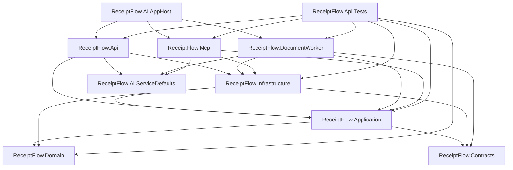
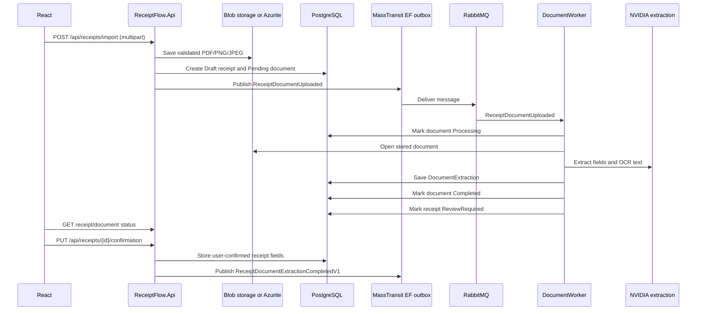
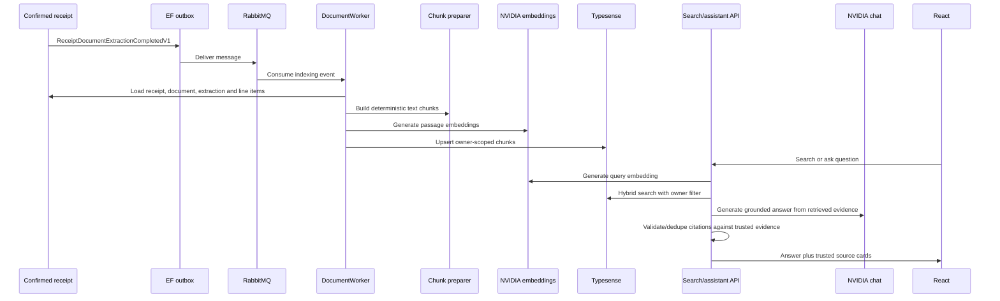
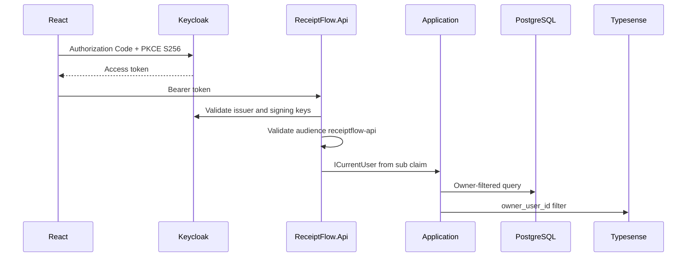

# Architecture and Workflows

ReceiptFlow.AI follows Clean Architecture boundaries: Domain contains business state and invariants; Application contains use cases and abstractions; Infrastructure implements persistence, storage, messaging, search and AI providers; API, Worker and MCP are host/presentation projects.

## Project Dependencies

`ReceiptFlow.AI.ServiceDefaults` supplies shared OpenTelemetry, health checks, service discovery and HTTP resilience. `ReceiptFlow.AI.AppHost` orchestrates local resources and injects service references and secret parameters into dependent projects.

## Upload, Extraction and Confirmation

The API also supports uploading a document to an existing receipt with `POST /api/receipts/{receiptId}/documents`. The upload-first import endpoint is the main frontend workflow.

## Indexing and RAG

Search indexes only completed documents attached to confirmed receipts with usable extraction or line-item content.

## Authentication

Confirmed Keycloak clients in the realm export include `receiptflow-web`, `receiptflow-api`, `receiptflow-mobile` and `postman`. `ReceiptFlow.Mcp` expects audience `receiptflow-mcp`; the matching public MCP client is documented as manual setup because it is not present in the checked-in realm export.

## Domain Model

`Receipt` owns line items and can have documents. `Document` belongs to one owner and may be attached to a receipt. `DocumentExtraction` is one-to-one with a document. Receipt lifecycle states are `Draft`, `Processing`, `ReviewRequired`, `Confirmed` and `Failed`. Document processing states are `Pending`, `Queued`, `Processing`, `AwaitingReview`, `Completed` and `Failed`.

Draft receipts intentionally allow nullable merchant/date/amount fields. The confirmed receipt is the canonical spending record; extraction data remains a suggestion/audit trail.
