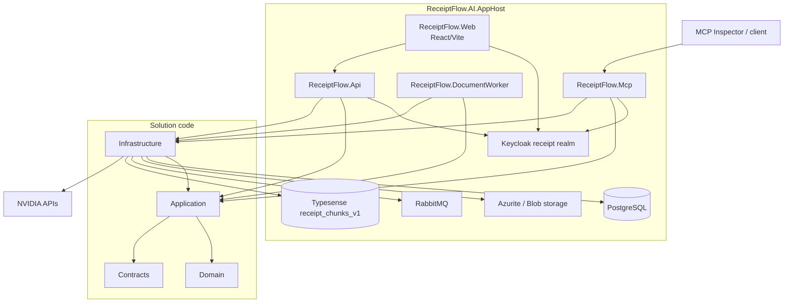
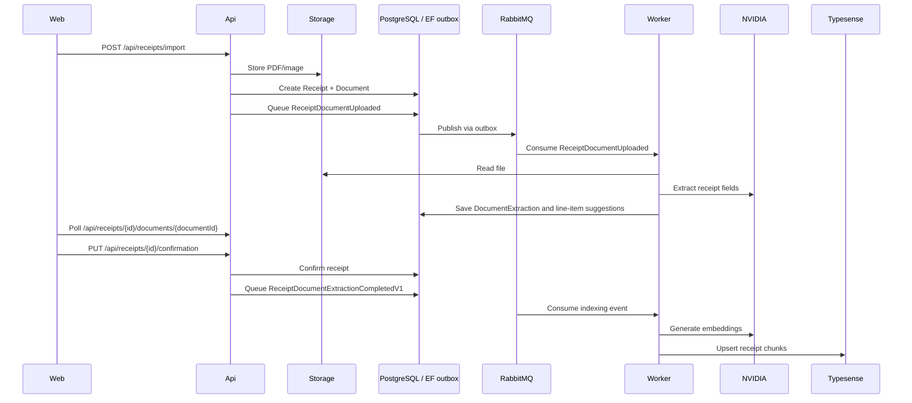
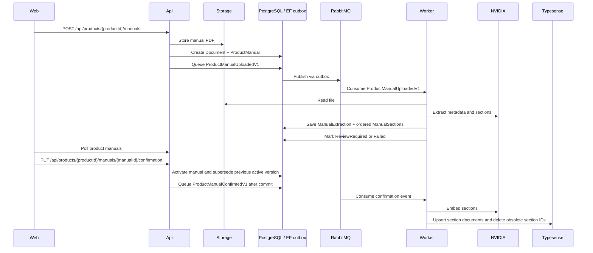
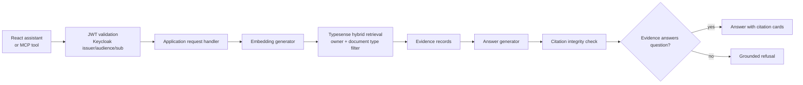
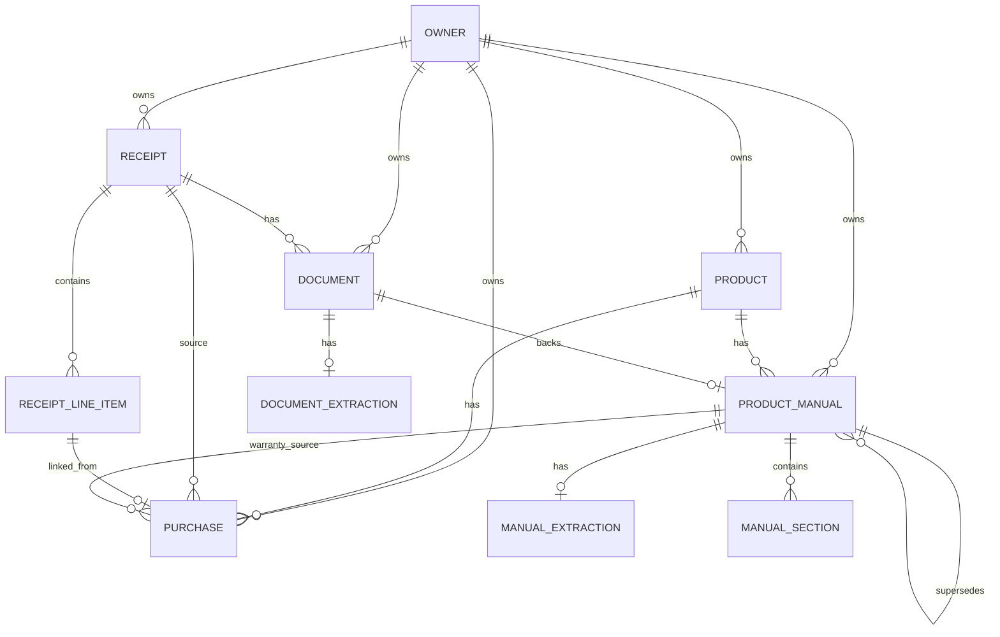

# Architecture

ReceiptFlow.AI uses Clean Architecture boundaries with separate hosts for HTTP requests, background work and MCP. The Application layer owns use cases and provider-neutral interfaces; Infrastructure supplies EF Core, storage, messaging, Typesense and NVIDIA implementations.

## Project responsibilities

| Project                          | Responsibility                                                                                                                                          |
| -------------------------------- | ------------------------------------------------------------------------------------------------------------------------------------------------------- |
| `ReceiptFlow.Domain`             | Domain model and invariants for receipts, documents, products, manuals, sections and purchases.                                                         |
| `ReceiptFlow.Contracts`          | Versioned integration events: `ReceiptDocumentUploaded`, `ReceiptDocumentExtractionCompletedV1`, `ProductManualUploadedV1`, `ProductManualConfirmedV1`. |
| `ReceiptFlow.Application`        | Use-case handlers, request/response DTOs and abstractions.                                                                                              |
| `ReceiptFlow.Infrastructure`     | EF Core DbContext/configurations/migrations, repositories, storage, MassTransit, Typesense and NVIDIA implementations.                                  |
| `ReceiptFlow.Api`                | Authenticated ASP.NET Core API.                                                                                                                         |
| `ReceiptFlow.DocumentWorker`     | MassTransit consumers for extraction and indexing.                                                                                                      |
| `ReceiptFlow.Mcp`                | Authenticated read-only MCP server.                                                                                                                     |
| `ReceiptFlow.AI.ServiceDefaults` | Aspire service defaults.                                                                                                                                |
| `ReceiptFlow.AI.AppHost`         | Aspire orchestration for local services and containers.                                                                                                 |
| `ReceiptFlow.Api.Tests`          | Backend automated tests.                                                                                                                                |
| `ReceiptFlow.Web`                | React frontend.                                                                                                                                         |

## Component diagram

```mermaid
flowchart TB
  subgraph AppHost["ReceiptFlow.AI.AppHost"]
    Web["ReceiptFlow.Web<br/>React/Vite"]
    Api["ReceiptFlow.Api"]
    Worker["ReceiptFlow.DocumentWorker"]
    Mcp["ReceiptFlow.Mcp"]
    Keycloak["Keycloak receipt realm"]
    Postgres[("PostgreSQL")]
    Azurite["Azurite / Blob storage"]
    RabbitMQ["RabbitMQ"]
    Typesense[("Typesense receipt_chunks_v1")]
  end

  subgraph Code["Solution code"]
    Domain["Domain"]
    Application["Application"]
    Infrastructure["Infrastructure"]
    Contracts["Contracts"]
  end

  Nvidia["NVIDIA APIs"]
  McpClient["MCP Inspector / client"]

  Web --> Keycloak
  Web --> Api
  McpClient --> Mcp
  Api --> Keycloak
  Mcp --> Keycloak
  Api --> Application
  Worker --> Application
  Mcp --> Application
  Application --> Domain
  Application --> Contracts
  Infrastructure --> Application
  Api --> Infrastructure
  Worker --> Infrastructure
  Mcp --> Infrastructure
  Infrastructure --> Postgres
  Infrastructure --> Azurite
  Infrastructure --> RabbitMQ
  Infrastructure --> Typesense
  Infrastructure --> Nvidia
```

## Receipt-processing sequence

```mermaid
sequenceDiagram
  participant Web
  participant Api
  participant Storage
  participant Db as PostgreSQL / EF outbox
  participant Bus as RabbitMQ
  participant Worker
  participant AI as NVIDIA
  participant Search as Typesense

  Web->>Api: POST /api/receipts/import
  Api->>Storage: Store PDF/image
  Api->>Db: Create Receipt + Document
  Api->>Db: Queue ReceiptDocumentUploaded
  Db->>Bus: Publish via outbox
  Bus->>Worker: Consume ReceiptDocumentUploaded
  Worker->>Storage: Read file
  Worker->>AI: Extract receipt fields
  Worker->>Db: Save DocumentExtraction and line-item suggestions
  Web->>Api: Poll /api/receipts/{id}/documents/{documentId}
  Web->>Api: PUT /api/receipts/{id}/confirmation
  Api->>Db: Confirm receipt
  Api->>Db: Queue ReceiptDocumentExtractionCompletedV1
  Bus->>Worker: Consume indexing event
  Worker->>AI: Generate embeddings
  Worker->>Search: Upsert receipt chunks
```

## Manual-processing sequence

```mermaid
sequenceDiagram
  participant Web
  participant Api
  participant Storage
  participant Db as PostgreSQL / EF outbox
  participant Bus as RabbitMQ
  participant Worker
  participant AI as NVIDIA
  participant Search as Typesense

  Web->>Api: POST /api/products/{productId}/manuals
  Api->>Storage: Store manual PDF
  Api->>Db: Create Document + ProductManual
  Api->>Db: Queue ProductManualUploadedV1
  Db->>Bus: Publish via outbox
  Bus->>Worker: Consume ProductManualUploadedV1
  Worker->>Storage: Read file
  Worker->>AI: Extract metadata and sections
  Worker->>Db: Save ManualExtraction + ordered ManualSections
  Worker->>Db: Mark ReviewRequired or Failed
  Web->>Api: Poll product manuals
  Web->>Api: PUT /api/products/{productId}/manuals/{manualId}/confirmation
  Api->>Db: Activate manual and supersede previous active version
  Api->>Db: Queue ProductManualConfirmedV1 after commit
  Bus->>Worker: Consume confirmation event
  Worker->>AI: Embed sections
  Worker->>Search: Upsert section documents and delete obsolete section IDs
```

## RAG and MCP request flow

```mermaid
flowchart LR
  A["React assistant<br/>or MCP tool"] --> B["JWT validation<br/>Keycloak issuer/audience/sub"]
  B --> C["Application request handler"]
  C --> D["Embedding generator"]
  D --> E["Typesense hybrid retrieval<br/>owner + document type filter"]
  E --> F["Evidence records"]
  F --> G["Answer generator"]
  G --> H["Citation integrity check"]
  H --> I{"Evidence answers question?"}
  I -- yes --> J["Answer with citation cards"]
  I -- no --> K["Grounded refusal"]
```

## Owner isolation

- API and MCP derive ownership from authenticated token claims.
- Client requests do not accept an owner ID.
- EF queries and relationships include `owner_user_id` at owner-scoped boundaries.
- Typesense documents include `owner_user_id`; searches and cleanup operations filter by owner.

## API surface

| Area              | Endpoints                                                                                                                                                                                                                                                                          |
| ----------------- | ---------------------------------------------------------------------------------------------------------------------------------------------------------------------------------------------------------------------------------------------------------------------------------- |
| Auth              | `GET /api/auth/me`                                                                                                                                                                                                                                                                 |
| Dashboard         | `GET /api/dashboard`                                                                                                                                                                                                                                                               |
| Receipts          | `GET /api/receipts`, `POST /api/receipts`, `POST /api/receipts/import`, `GET /api/receipts/{id}`, `PUT /api/receipts/{receiptId}/confirmation`                                                                                                                                     |
| Receipt documents | `POST /api/receipts/{receiptId}/documents`, `GET /api/receipts/{receiptId}/documents`, `GET /api/receipts/{receiptId}/documents/{documentId}`, `POST /api/receipts/{receiptId}/documents/{documentId}/reindex`                                                                     |
| Products/manuals  | `POST /api/products`, `GET /api/products`, `GET /api/products/{productId}`, `POST /api/products/{productId}/manuals`, `GET /api/products/{productId}/manuals`, `GET /api/products/{productId}/manuals/{manualId}`, `PUT /api/products/{productId}/manuals/{manualId}/confirmation` |
| Purchases         | `GET /api/receipts/{receiptId}/unlinked-items`, `GET /api/purchases`, `POST /api/purchases`, `DELETE /api/purchases/{purchaseId}`, `PUT /api/purchases/{purchaseId}/manual`                                                                                                        |
| Search/assistant  | `POST /api/search/receipts`, `POST /api/assistant/receipts/ask`                                                                                                                                                                                                                    |

## MCP tools

| Tool                  | Purpose                                                |
| --------------------- | ------------------------------------------------------ |
| `search_receipts`     | Search authenticated user's receipt evidence.          |
| `search_manuals`      | Search authenticated user's confirmed manual sections. |
| `ask_receipts`        | Ask grounded questions over receipt evidence.          |
| `ask_product_manuals` | Ask grounded questions over manual evidence.           |

## Data model

```mermaid
erDiagram
  OWNER ||--o{ RECEIPT : owns
  OWNER ||--o{ DOCUMENT : owns
  OWNER ||--o{ PRODUCT : owns
  OWNER ||--o{ PRODUCT_MANUAL : owns
  OWNER ||--o{ PURCHASE : owns
  RECEIPT ||--o{ RECEIPT_LINE_ITEM : contains
  RECEIPT ||--o{ DOCUMENT : has
  DOCUMENT ||--o| DOCUMENT_EXTRACTION : has
  PRODUCT ||--o{ PRODUCT_MANUAL : has
  DOCUMENT ||--o| PRODUCT_MANUAL : backs
  PRODUCT_MANUAL ||--o| MANUAL_EXTRACTION : has
  PRODUCT_MANUAL ||--o{ MANUAL_SECTION : contains
  PRODUCT_MANUAL ||--o{ PRODUCT_MANUAL : supersedes
  PRODUCT ||--o{ PURCHASE : has
  RECEIPT ||--o{ PURCHASE : source
  RECEIPT_LINE_ITEM ||--o| PURCHASE : linked_from
  PRODUCT_MANUAL ||--o{ PURCHASE : warranty_source
```
