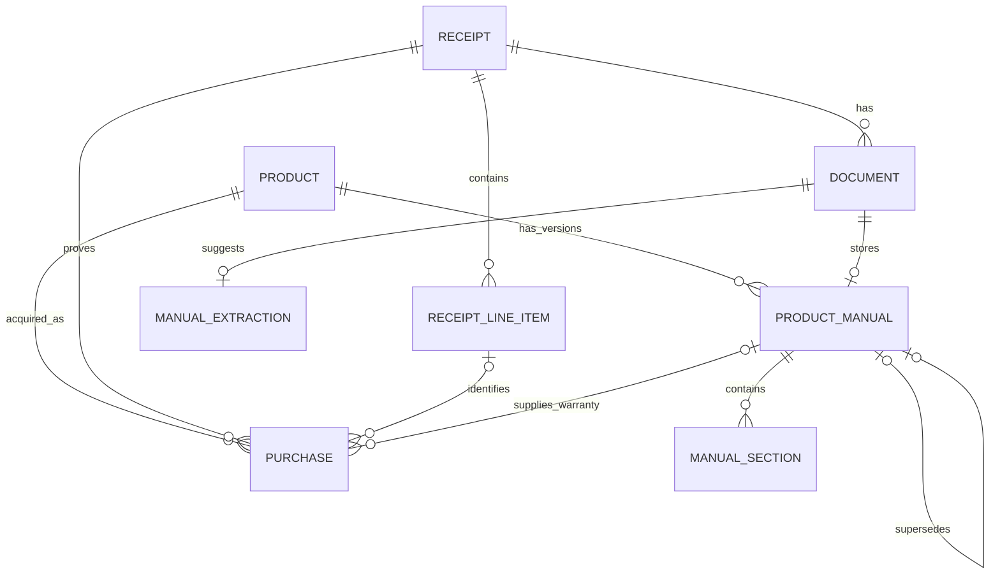

# Product Manual Support Design

## Executive recommendation

Extend ReceiptFlow additively around the existing receipt aggregate:

- Keep `Receipt`, receipt upload, confirmation, extraction, events, APIs, search, and MCP tools unchanged.
- Add stable `Product` and `Purchase` entities.
- Represent every uploaded manual PDF as the existing generic `Document` plus an immutable, product-linked `ProductManual` version.
- Store manual extraction suggestions separately from confirmed product/manual data, mirroring the existing receipt/extraction distinction.
- Index confirmed receipt chunks and active manual-version sections into a new owner-isolated Typesense v2 collection with a discriminated source type.
- Add a document-aware assistant path whose trusted citations can identify either a receipt or a manual. Retain the receipt-only API and the `search_receipts` and `ask_receipts` MCP tools for compatibility.
- Calculate warranty expiry in application code from a confirmed receipt purchase date and a duration pinned to the applicable manual version. The language model may explain that result, but must not calculate it.

This is the smallest clean design because it does not generalize or rewrite the working receipt aggregate and worker before manual support needs that generalization. It adds a parallel manual pipeline at the existing storage, outbox, extraction-provider, embedding, search, authentication, and UI seams.

## Current-state findings

### Domain and PostgreSQL

- `Receipt` is the aggregate root for confirmed purchase facts, line items, lifecycle state, and attached documents. Draft receipts intentionally permit incomplete financial data; confirmation makes the receipt the canonical record.
- `Document` is mostly generic: it owns the Keycloak `sub`, storage metadata, hash, document type, processing lifecycle, page count, extracted-text key, and failure state. It currently has only a nullable `ReceiptId` parent association.
- `DocumentType` already contains `ProductManual`, `Warranty`, `InstallationGuide`, and other future-facing values. They are stored as strings, so using `ProductManual` does not require altering a PostgreSQL enum. No current upload or processing flow uses it.
- `DocumentExtraction` is not generic in practice. Its one-to-one schema is receipt-specific: merchant, transaction date, monetary fields, currency, category, and receipt-shaped structured data.
- `ReceiptLineItem` already has an optional `ProductCode`, but neither it nor a line-item description is a safe product identity. There is no `Product`, `Purchase`, or manual-version model.
- PostgreSQL contains receipts, documents, document extractions, receipt line items, and MassTransit inbox/outbox tables. Owner columns and indexes exist, but tenant isolation is enforced by application queries rather than PostgreSQL row-level security.
- Receipt/document relationships use ordinary ID foreign keys. The domain checks matching owners when attaching a document, while repositories repeat owner predicates on reads.

### Upload, extraction, and worker

- The authenticated upload handler validates size, extension, content type, and file signature. It accepts JPEG, PNG, and PDF, but every accepted PDF is classified as `ReceiptPdf`.
- Both import and replacement-document upload are receipt-specific. They create or load a receipt, store through the provider-neutral `IDocumentStorage`, persist through the EF outbox, and publish `ReceiptDocumentUploaded` with a required `ReceiptId`.
- `ReceiptDocumentUploadedConsumer` is tightly coupled to a receipt and uses `IDocumentExtractor`, whose provider-neutral interface returns a receipt-shaped `DocumentExtractionResult`.
- The NVIDIA adapter supports PDFs as well as images, including text extraction and scanned-page handling, but its prompt and structured schema extract receipt fields only.
- Successful extraction persists receipt suggestions and line items, then moves the receipt to review. Only confirmed receipts are eligible for indexing. Transient failures are retried; non-transient failures are stored internally and exposed through a safe generic message.
- Receipt extraction and indexing contracts are versioned receipt events with non-null receipt identifiers. Altering those contracts to serve manuals would risk the working workflow and queued messages.

### Typesense and retrieval

- Receipt chunk preparation builds a receipt summary, line-item paragraphs, and normalized OCR lines, then applies fixed-size overlapping chunks. Chunk IDs are deterministic per document and index.
- The Typesense model and collection are receipt-shaped. Required fields include `receipt_id`, `document_id`, `owner_user_id`, and receipt metadata. Schema compatibility is checked strictly.
- Every search query includes an escaped exact `owner_user_id` filter. Obsolete chunks are deleted by both document and owner, which is an important invariant to retain.
- Search indexes only completed documents attached to confirmed receipts. Hybrid retrieval uses the provider-neutral embedding and search abstractions, but their request and result records currently require receipt identifiers.
- A schema expansion should use a new collection name and controlled reindex/cutover. Mutating the existing strict v1 schema in place would complicate rollback and compatibility.

### RAG assistant and citations

- The assistant retrieves up to five receipt chunks, caps evidence size, groups citations by `(ReceiptId, DocumentId)`, validates model-declared citation IDs against trusted retrieved evidence, and removes unknown citations.
- The answer-generator interface is provider-neutral, while its evidence contract and NVIDIA prompt are receipt-specific. Retrieved OCR is explicitly treated as untrusted text, which must also apply to manuals.
- Assistant source responses require receipt IDs. The React citation card resolves a filename through receipt-document queries and routes only to a receipt detail page.
- Warranty expiry is not present. It should not be inferred or date-calculated by RAG because the underlying facts and arithmetic can be handled deterministically.

### Authorization, MCP, and frontend

- API controllers require authentication and a `sub` claim. `ICurrentUser` supplies that subject, and receipt repositories, handlers, indexing consumers, and Typesense queries scope access by it.
- The MCP server is also authenticated and owner-scoped. Its existing `search_receipts` and `ask_receipts` tools call the same receipt handlers and intentionally minimize the subject in logs.
- The React application has dashboard, receipt library/detail, upload, receipt search, and receipt assistant routes. API contracts, query keys, upload copy, result cards, citations, and navigation are receipt-specific.
- The current upload UI already accepts PDFs, but that must not be reused as an ambiguous “automatic document type” upload: document purpose should be explicit and product context must be known for a manual.

## Proposed entities and relationships



### `Product`

The stable owner-scoped identity that replacement manuals must reuse.

| Field | Purpose |
| --- | --- |
| `Id`, `OwnerUserId` | Identity and tenant boundary |
| `Manufacturer`, `Name`, `ModelNumber` | User-confirmed canonical product metadata |
| `NormalizedManufacturer`, `NormalizedModelNumber` | Owner-local duplicate detection; never shown as canonical data |
| `CreatedAtUtc`, `UpdatedAtUtc` | Audit timestamps |

Use a partial unique index on `(owner_user_id, normalized_manufacturer, normalized_model_number)` when a model number is present. Do not automatically merge products using only a name or receipt line-item description. When the model number is absent, require the user to select an existing product or explicitly create a new one.

### `Purchase`

An owner-scoped association between a stable product and a confirmed receipt.

| Field | Purpose |
| --- | --- |
| `Id`, `OwnerUserId` | Identity and tenant boundary |
| `ProductId`, `ReceiptId` | Required product and proof-of-purchase links |
| `ReceiptLineItemId` | Optional precise line-item link |
| `Quantity` | Defaults to one; supports multi-unit line items |
| `WarrantySourceProductManualId` | Exact confirmed manual version used for warranty terms |
| `WarrantyDurationMonthsSnapshot` | Confirmed duration copied from that version for historical stability |
| `CreatedAtUtc`, `UpdatedAtUtc` | Audit timestamps |

Only a confirmed, same-owner receipt may be linked. If a line item is supplied, it must belong to that receipt. A uniqueness rule should prevent the same product/receipt/line-item association from being added twice while still allowing legitimate multiple purchases.

Do not persist a mutable “current warranty expiry” on `Product`. A query service should calculate:

```text
expiry date = confirmed receipt purchase date + warranty duration snapshot
```

The duration snapshot retains provenance through `WarrantySourceProductManualId`, so replacing a manual does not silently rewrite an existing purchase’s warranty. Reassessment can be an explicit later operation.

### `ProductManual`

One immutable version of a product’s manual, backed one-to-one by a `Document` whose type is `ProductManual`.

| Field | Purpose |
| --- | --- |
| `Id`, `OwnerUserId`, `ProductId`, `DocumentId` | Identity, tenant boundary, stable product, and stored PDF |
| `ManualKind`, `Locale` | Optional future-safe discriminator; default `UserManual` and an explicit/unknown locale |
| `VersionLabel` | User-confirmed document version |
| `WarrantyDurationMonths` | Nullable user-confirmed duration extracted from this version |
| `LifecycleStatus` | `Processing`, `ReviewRequired`, `Active`, `Failed`, or `Superseded` |
| `SupersedesProductManualId` | Previous immutable version in the chain |
| `CreatedAtUtc`, `ConfirmedAtUtc`, `SupersededAtUtc` | Audit timestamps |

At most one version should be active for `(owner, product, manual kind, locale)`, enforced with a partial unique index. Uploading a replacement creates a new `ProductManual` for the same `ProductId`; it never creates another product. The old version remains active and searchable until the replacement has been successfully extracted and confirmed. Activation and supersession occur in one transaction.

### `ManualExtraction` and `ManualSection`

Do not add manual columns to the receipt-shaped `DocumentExtraction` table.

`ManualExtraction` is a one-to-one, immutable extraction record for the document. It holds suggested manufacturer, product name, model number, document version, warranty duration, confidence, provider/model identifiers, extraction timestamp, and structured provider output. These values are suggestions until reviewed; they must not overwrite an existing `Product` automatically.

`ManualSection` is the canonical section-level extraction used for reindexing. Store owner ID, product-manual ID, heading path, ordinal, optional page start/end, normalized content, and checksum. A heading path such as `Safety > Electrical requirements` is more useful than a flat title. Raw provider output may remain in `ManualExtraction.StructuredDataJson`; normalized section content can live in PostgreSQL initially. If size measurements later justify object storage, `Document.ExtractedTextStorageKey` already provides a provider-neutral seam.

For all new associations, add composite unique keys such as `(id, owner_user_id)` and composite foreign keys that include `owner_user_id`. Application handlers must still apply owner predicates and domain invariants. This gives new tables a database-level defense against cross-owner links without requiring a redesign of existing receipt tables.

## Processing and indexing flow

1. The authenticated user selects or explicitly creates a product, then uploads a manual through a product-scoped endpoint. Manuals accept PDF only.
2. The API validates filename, MIME type, `%PDF` signature, configured byte/page limits, and ownership. It stores the file through `IDocumentStorage`, creates a `Document(ProductManual)` and a processing `ProductManual`, and publishes a new versioned `ProductManualUploadedV1` event through the EF outbox.
3. Add a separate manual consumer rather than making `ReceiptDocumentUploaded` identifiers nullable. It opens storage and invokes a provider-neutral `IManualDocumentExtractor`. The existing receipt consumer and `IDocumentExtractor` contract remain untouched.
4. The manual extractor returns metadata suggestions and ordered sections with headings and page ranges. The first provider adapter may reuse the existing PDF text/OCR mechanics, but the application contract must not mention NVIDIA.
5. The worker persists `ManualExtraction` and `ManualSection` records, safely marks failures, and moves the manual to `ReviewRequired`. It never updates confirmed `Product` metadata from extraction alone.
6. The UI lets the user compare suggestions with the selected product, edit version/warranty fields, and confirm. Confirmation activates the new version and supersedes the prior active version atomically, then publishes `ProductManualReadyForIndexingV1`.
7. The indexing consumer validates document/manual/product owner equality and active status. It chunks within each section, never across section boundaries. Each chunk carries the heading path and page range, and uses a deterministic ID such as `{documentId}:{sectionOrdinal}:{chunkOrdinal}` plus a checksum.
8. The consumer embeds passages through `ITextEmbeddingGenerator`, upserts them, and deletes obsolete chunks using both document ID and owner ID. When a version is superseded, its chunks are removed or marked non-current so normal retrieval cannot return them. Retaining PostgreSQL section records preserves audit/history and supports reindexing.

### Typesense v2 document shape

Create a new collection, for example `document_chunks_v2`, rather than modifying `receipt_chunks_v1` in place.

Required common fields:

- `id`, `owner_user_id`, `source_type` (`receipt` or `manual`), `document_id`
- nullable `receipt_id`, `product_id`, and `product_manual_id`
- `chunk_index`, nullable `section_ordinal`, `section_heading`, `page_start`, and `page_end`
- `source_title`, `original_file_name`, `content`, `content_checksum`, `extracted_at`, and `embedding`
- optional receipt facets: merchant, purchase date, category, currency, total
- optional manual facets: manufacturer, product name, model number, version, warranty duration, manual kind, locale, and active-version flag

Every query must continue to include exact `owner_user_id` filtering. Application search can additionally scope by source type. Manual chunks should prepend a compact metadata/heading prefix before embedding and querying, but citations should display the clean section content and metadata.

Populate v2 with confirmed receipts using an adapter around the current preparer, then add active manuals. Cut API/worker configuration to v2 only after counts, owner filters, and representative searches pass. Keep v1 available for rollback until the cutover is accepted.

## Assistant and citation design

Introduce generic evidence and source contracts for the new assistant path:

```text
DocumentEvidence
  Citation, SourceType, DocumentId, Content, SourceTitle
  Receipt metadata? Product/manual metadata? Section/page metadata?

DocumentAnswerSource
  Citation, SourceType, DocumentId
  ReceiptId? ProductId? ProductManualId?
  SourceTitle, OriginalFileName, SectionHeading?, PageStart?, PageEnd?
  Receipt metadata? Manual metadata?
```

Group citations by document and source type; multiple chunks from the same document may share one citation while retaining the most relevant section/page reference. Continue validating every returned citation ID against retrieved evidence. The generator prompt must call all extracted document content untrusted data and support both receipt and manual metadata.

For questions such as “When does the warranty on my Model X expire?”, application retrieval should:

1. Resolve an owner-scoped `Purchase` and its product.
2. Read the confirmed receipt purchase date.
3. Read the pinned manual version and warranty-duration snapshot.
4. Calculate the expiry deterministically.
5. Supply the calculation result plus receipt and manual evidence to answer generation.

The answer should cite both the receipt source for the purchase date and the manual source for warranty duration. If either fact is missing or ambiguous, return that limitation instead of estimating.

Keep `/api/assistant/receipts/ask`, receipt response contracts, and existing MCP tools receipt-only for compatibility. Add a document-aware endpoint such as `POST /api/assistant/ask` for the React assistant and later add new MCP tools such as `search_documents` and `ask_purchases`. Do not silently broaden `search_receipts` or change its structured output.

## API changes

Add owner-scoped resources without changing existing receipt routes:

- `GET /api/products` and `GET /api/products/{productId}`
- `POST /api/products` and `PUT /api/products/{productId}` for confirmed canonical metadata
- `POST /api/products/{productId}/manuals` for a new PDF/manual family
- `POST /api/products/{productId}/manuals/{manualId}/replacements` for a new version of the same product/manual family
- `GET /api/products/{productId}/manuals` and `GET /api/products/{productId}/manuals/{manualId}` for status, extraction suggestions, sections, and version history
- `PUT /api/products/{productId}/manuals/{manualId}/confirmation` to confirm metadata/warranty and activate the version
- `POST /api/receipts/{receiptId}/purchases` with `productId`, optional `receiptLineItemId`, quantity, and optional warranty-source manual ID
- `GET /api/products/{productId}/purchases` returning receipt provenance and calculated warranty information
- `POST /api/search/documents` with explicit `receipt`, `manual`, or `all` scope
- `POST /api/assistant/ask` returning discriminated receipt/manual citations

Upload and confirmation responses should expose safe lifecycle state, validation problems, and user-actionable errors, never provider exceptions, storage keys, prompts, or raw structured model output.

## Frontend changes

- Add a Product Library and product detail page. The detail page shows canonical manufacturer/name/model, linked purchases, calculated warranty status, active manual, and prior manual versions.
- Add a product-scoped PDF manual upload/replacement flow. Require the user to select an existing product or explicitly create one before upload; replacement starts from the current product/manual so it cannot duplicate the product.
- Add a manual review form for extracted manufacturer, product name, model number, version, and warranty duration. Visually distinguish extracted suggestions from confirmed values.
- Add “Link product” to confirmed receipt line items and receipt details. Do not alter receipt confirmation or automatic polling behavior.
- Extend Search with source-type filters and manual result cards showing product, model, section, pages, version, and filename. Keep the existing receipt-only search route available.
- Move the main assistant UI to the document-aware endpoint and render a discriminated source card: receipt citations link to receipt details; manual citations link to the product/manual and relevant section/page. Typed and voice composer behavior remains unchanged.
- Reuse existing cards, status badges, upload/file-picker patterns, errors, loading states, query invalidation conventions, and responsive design tokens.

## Migration and rollout plan

1. **Additive persistence foundation**
   - Add `products`, `purchases`, `product_manuals`, `manual_extractions`, and `manual_sections` with owner-aware indexes and composite ownership foreign keys.
   - Use the existing string `ProductManual` document type; do not modify receipt data.
   - Add repository and domain tests for ownership, duplicate prevention, version activation, purchase linking, and warranty calculation.
2. **Manual upload and extraction**
   - Add PDF-only product/manual APIs, versioned events, outbox publisher methods, manual extraction abstraction/adapter, and worker consumer.
   - Reuse storage and PDF/OCR primitives while leaving receipt messages and consumers unchanged.
3. **Review, linking, and warranty**
   - Add manual metadata confirmation, atomic version replacement, receipt-to-product purchase linking, and the deterministic warranty query service.
   - Ship product/manual frontend pages behind a feature flag if staged deployment is required.
4. **Unified search v2**
   - Create the v2 collection, index active manuals, backfill confirmed receipt chunks, validate tenant filters and search quality, then cut over configuration.
   - Retain v1 temporarily for rollback; no database backfill is required for existing receipts.
5. **Document-aware assistant and UI**
   - Add generic evidence/citation contracts and provider-neutral grounded-answer abstraction.
   - Switch the React assistant to the new endpoint and add receipt/manual citation cards. Keep receipt-only endpoints and MCP tools operational.
6. **MCP extension and hardening**
   - Add new document/product tools without renaming or changing `search_receipts` and `ask_receipts`.
   - Add cross-tenant integration tests spanning API, worker event handling, Typesense filters, assistant citations, and MCP.

## Security and tenant-isolation considerations

- Derive ownership only from the authenticated Keycloak `sub`; never accept `OwnerUserId` from an API body, route, message caller, or MCP argument.
- Scope every product, purchase, manual, section, and replacement query by both ID and owner. Return not-found for cross-owner IDs to avoid existence disclosure.
- Validate owner equality at domain boundaries, before publishing/indexing, and with composite owner foreign keys in new tables. Do not rely on a Typesense filter to compensate for a bad relational link.
- Keep exact escaped `owner_user_id` filtering mandatory in every Typesense query and delete. Store Typesense administration keys only server-side.
- Make storage keys opaque and private. Verify a same-owner relational record before opening or serving any source document.
- Accept manuals only when extension, MIME type, and PDF signature agree. Add byte, page, extraction-time, decompression, and section-count limits; reject encrypted or malformed PDFs safely.
- Treat manual content as adversarial prompt input. Delimit it as untrusted, ignore embedded instructions, cap evidence, validate citations, and never expose raw provider exceptions.
- Do not log manual text, assistant evidence, storage keys, access tokens, or raw user identifiers. Continue hashed/minimized MCP subject logging.
- Define retention and deletion across Product, ProductManual, Purchase, object storage, Typesense, and outbox records. Product deletion must not orphan private blobs or searchable chunks.
- PostgreSQL row-level security is not currently present. It can be evaluated as broader defense-in-depth, but manual support should not introduce a manual-only RLS model that behaves differently from receipts without a planned application-wide rollout.

## Risks and open decisions

- **Product identity:** confirm normalization rules and whether manufacturer plus model number is sufficient. Model aliases, regional variants, and missing model numbers require user review rather than automatic merging.
- **Warranty semantics:** manuals may describe limited warranties, different component durations, registration requirements, territories, or a start date other than purchase. Decide whether v1 supports only one simple calendar-month duration and how ambiguity is presented.
- **Date semantics:** `Receipt.PurchaseDate` is a timestamp stored in UTC. Define which calendar date and timezone govern `AddMonths`, end-of-month behavior, and whether expiry is inclusive before exposing warranty alerts.
- **Version applicability:** decide whether an uploaded replacement applies only to future purchases or may be explicitly reassigned to historical purchases. The recommended default is to preserve each purchase’s pinned source and duration snapshot.
- **Manual families and locale:** confirm whether one active user manual per product is enough. `ManualKind` and `Locale` prevent an English user guide from superseding a service guide or another language accidentally.
- **Section quality:** headings and page ranges can be unreliable in scanned or unusually laid-out PDFs. Establish confidence thresholds and a fallback page-based section strategy, then measure retrieval quality with representative manuals.
- **Limits and cost:** manual PDFs are longer than receipts. Set maximum bytes/pages/sections, embedding batch sizes, and reindex budgets before enabling broad uploads.
- **Search cutover:** collection v2 doubles indexing during migration and requires an explicit rollback window. Validate source-type filters and owner isolation before switching the assistant.
- **Citation granularity:** decide whether a citation represents a document or a specific section/page. The recommended API supports section/page detail while deduplicating the visible citation at document level.
- **Deletion and audit:** decide whether superseded manual blobs are retained indefinitely, archived, or deleted after a retention period. Existing purchases need enough immutable provenance to explain warranty calculations.
- **MCP surface:** choose names and response schemas for new manual/product tools. Existing receipt tools should remain strictly receipt-scoped and backward compatible.
